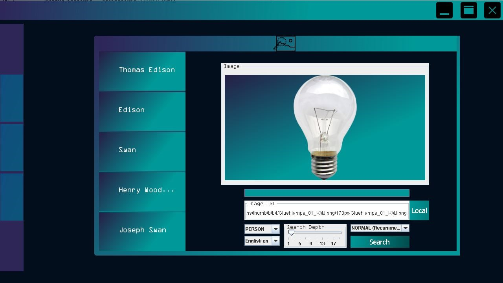
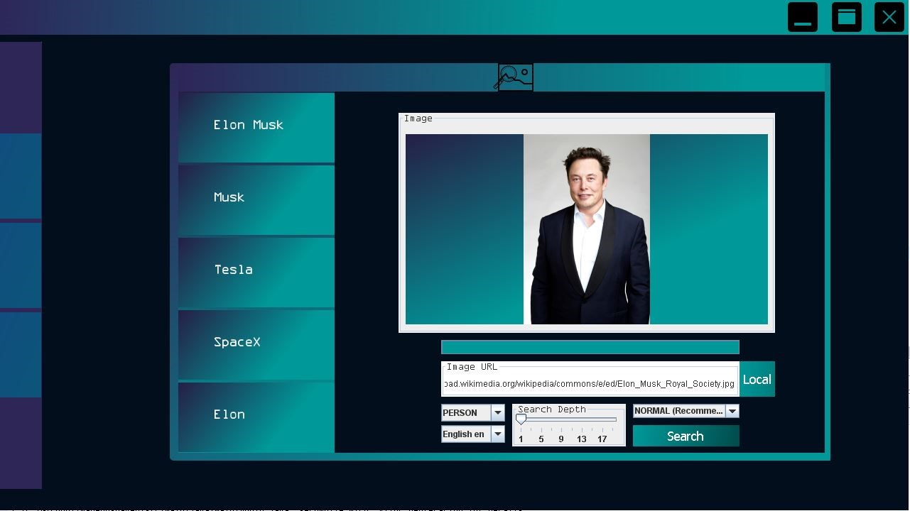

# ImageOps 
*ImageOPS* is a Reverse Image Entity Search Software written with Java using Maven, JavaFX and Java Swing. 

It uses multiple APIs, Named Entity Recognition using Natural Language Processing, page parsing algorithms with css queries, regular expressions, http requests and data conversion algorithms to search entities along the web related to user given image and entity type. At the end, it diplays most mentioned entities relative to image.

---
## Search Parameters

* ### Image
  #### Image can be selected from local storage or from given URL.  Software can understand if passed path is URL or local storage path.

* ### Entity Type 
  #### Entity type to search

       PERSON: Person Names
       ORG: Organization Names
       LOC: Location Names
       DATE: Dates
       PRODUCT: Product Names
       LAW: Territory, Law Names

* ### Language
  #### Preffered Language For Search
  
      current: Default Of Browser
      English  
      Turkish 
      German 
      Turkmen 
      Russian 
      Korean 
      Spanish 
      
* ### Search Depth
  #### Ranges between 1-20. Indicates how detailed the search will be. The more detailed the search, the longer it takes. ( ~1 minute to ~20 minutes)

* ### Parallel Search Option 
  #### Indicates parallel processing and threading in search. (Still working on it, Not Fully Optimized)
  
      NORMAL (Recommended): No threading in search
      PARALLEL            : Multiple threading in search
      
      
--- 

## Classes

* ### GUI
  #### Main class for graphical user interface extends from JPanel
  
* ### LOGIN
  #### Login Panel for software (Not currently active) extends from JPanel
  
* ### RapidAPI
  #### Class for constructing and implementing APIs from RapidAPI easily.
  
* ### ReverseImage
  #### Class for performing reverse image search along the web
  
* ### TextAnalyzer
  #### NLP Class for applying named entity processing to page content
  
* ### SYSTRAN_IO
  #### Alternative NLP Class for applying named entity processing to page content (Not Currently active)
  
* ### Tests
  #### Class for Testing software
  
* ### KeepToo Package
  #### Package for Gradient Colored GUI components.
  Source: https://github.com/k33ptoo/KGradientPanel 
  
---

## Screenshots
 
### Light Bulb Image, Person Entity Search 

 
 ---
 
### Elon Musk Image, Person Entity Search

  
  
  
  

  
  
  

      
